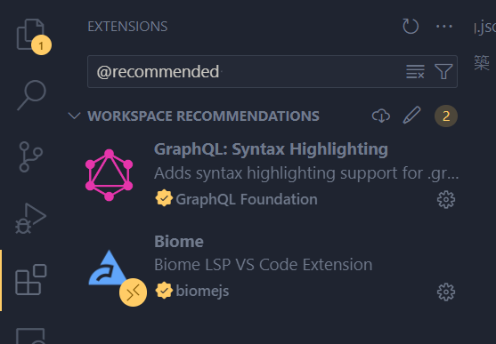

# graphql-handson

# 目次

0. ハンズオン全体の構成について
1. 環境構築：ライブラリのインストール等
2. Hello, GraphQL
3. クエリ事始

# 0. ハンズオン全体の構成について

このハンズオンの目的はGraphQLの概要を抑えることです。概要には、GraphQLの概要を抑え、Queryの基礎を把握することが含まれます。基本的なライブラリのセットアップ等は完了しているので、各自のローカルマシン側の環境構築（1.の章）を実施すればすぐに開発を始められるようになっています。


# 1. 環境構築：ライブラリのインストール等

まず、WSL等のセットアップが済んでいない方は以下の手順に従ってセットアップをしてください。

https://gist.github.com/Showichiro/4f08e3a77980eac1729596eb79fa07d2

## リポジトリのclone

WSLのターミナル上でクローンします。

```sh
# ssh
git clone git@github.com:Showichiro/graphql-handson.git
# or https
git clone https://github.com/Showichiro/graphql-handson.git
```

## NodeJSのインストール

続いて所定のバージョンのNodeJSをインストールします。

```sh
# .nvmrcでバージョン指定しているのでnvmを利用している場合はこのコマンドでOK
nvm use # nvm使っていない場合は、各自で21系を利用するように設定してください。
```

NodeJSはJavaScriptのサーバサイドランタイムです。

## pnpmのインストール

続いて、pnpmのインストール作業を行います。`corepack`によってバージョンを指定しているため、corepackを利用してインストール&パスを通します。


```sh
# nvm useしたターミナルで
corepack enable pnpm
pnpm -v # 9.3.0
pnpm i # corepack enable pnpmとやった時点でinstall走っているかも。
```

pnpmはライブラリ・依存関係のパッケージマネージャーです。

## 各種VSCodeの拡張機能のインストール

VSCodeでこのリポジトリを開いた状態で、左メニューからExtensions(□が4つあるアイコン)を選択する。


`Search Extensions`という検索窓に`@recommended`と入力し、`WORKSPACE RECOMMENDATIONS`に表示された拡張機能を全てインストールする。



## 開発サーバの起動

```sh
pnpm dev
```

`http://localhost:3000/graphql`にアクセスし、以下の画面がでればOK。


ターミナル上で`ctrl + c`を入力することで開発サーバを落とすことができます。


# 2.Hello, GraphQL

何はともあれ実際に、GraphQLのリクエストを投げてみましょう。

開発サーバを起動した状態で`http://localhost:3000/graphql`にアクセスします。

画面中央に`Query your server`というボタンがあるので押下します。

画面遷移し、以下のようにクエリのエディタが表示されます。


中央の`Operation`に以下のクエリを入力し、`▷Query`ボタンを押下してみてください。右側の`Response`の欄にGraphQLサーバからのレスポンスが表示されます。

```gql
{
  hello
}
```


このように、GraphQLサーバへのリクエストをブラウザ上から試すことができます。

では、このhelloというクエリはどのように実装されているのでしょうか。

`src/index.ts`を見ると、`typeDefs`、`resolvers`という二つのオブジェクトをimportしてServerを定義していることがわかります。

```ts
import { ApolloServer } from "apollo-server-express";
import { typeDefs, resolvers } from "./graphql";

const server = new ApolloServer({ typeDefs, resolvers });
```
では、`typeDefs`と`resolvers`というオブジェクトはどのように定義されているでしょうか。

`src/graphql.ts`を開いてください。以下のようになっています。


```ts
import { gql } from "apollo-server-express";

export const typeDefs = gql`
  type Query {
    hello: String
  }
`;

export const resolvers = {
  Query: {
    hello: () => "Hello, GraphQL with Apollo!",
  },
};
```

このtypeDefsという変数で宣言されている内容がGraphQLの`Schema`、resolversという変数で宣言されている内容がGraphQLの`Resolver`です。

## Schema

GraphQLはAPIのためのクエリ言語（特定の構文でリクエストやレスポンスを表現する）です。
GraphQLサーバとクライアントはGraphQL語でやり取りしているということです。

そして、このリクエスト・レスポンスのいわばIF仕様やIFの中で利用されるオブジェクトの型を定義するのが`Schema`です。

```mermaid
flowchart LR
 A[クライアント] -->|GraphQL語でリクエスト| B
 subgraph B[GraphQL サーバ]
  Schema
 end
```

Schemaにはリクエスト・レスポンスの仕様やその中で利用するオブジェクトの型を定義できます。

例えば、文字列型の名前(`name`)と数値型の年齢(`age`)を持つUserというオブジェクトを定義する場合は以下のようになります。

```gql
type User {
    name: String
    age: Int
}
```

`Query`という型は特別な型で、IFを表します。`src/graphql.ts`を見てみましょう。

```ts
import { gql } from "apollo-server-express";

export const typeDefs = gql`
  type Query {
    hello: String
  }
`;
```

このように書くことで、`hello`というリクエストに対しては、文字列型のデータを返す、とIFに定義したことになります。

先ほど、
```gql
{
  hello
}
```
とリクエストし、
```json
{
  "data": {
    "hello": "Hello, GraphQL with Apollo!"
  }
}
```

とレスポンスされた、一連の操作のIFを定義していたというわけです。

なお、GraphQLはSchemaに対して厳格であり、以下のように存在しないリソースを指定すると、エラーを返します。


```gql
{
    hoge
}
```


GraphQLのSchemaは絶対であり、クライアントのリクエストは必ず「Schema通りか」というバリデーションを課されるということです。

## Resolver

次に、`Resolver`について説明します。`Resolver`はいわば、IF仕様に対応するロジック部分の実装です。

```ts
export const typeDefs = gql`
  type Query {
    hello: String
  }
`;

export const resolvers = {
  Query: {
    hello: () => "Hello, GraphQL with Apollo!",
  },
};
```
`typeDefs`と`resolver`を見ると、同じ構造・同じプロパティを持っていることに気が付きます。そして、`resolvers`の`hello`は関数になっています。
実は、Apolloでは、構造とプロパティ名でIFとロジックを対応させています。（`hello`と送ると文字列型を返す）というIFに対して、`resolvers`の`hello`という関数が対応しているということです。

```gql
{
    hello
}
```
というクエリがリクエストされると

`resolvers`のhelloという関数が動き、`Hello, GraphQL with Apollo!`という固定の文字列を返しているということです。

### 課題

hello関数の実装を変えて、違う文字列を返すようにしてみましょう。

# 3.クエリ事始

ここからGraphQLの具体的なクエリの書き方のバリエーションをいくつか紹介し、GraphQLが`Graph`と冠する所以に迫っています。

## クエリのパターン紹介

### リクエストパラメータを取るクエリ

リクエストパラメータをSchemaに定義するには以下のように`(<パラメータ名>: <パラメータの型>)`の形式で書きます。複数の引数を取る場合は`,`でつなぎます。

```gql
type Query {
    helloWithName(name: String): String
    hogeFuga(a: String, b: Int): String
}
```

対応するResolverは関数の`第二`引数でリクエストパラメータを取ることができます(第一引数の役割は後述)。例えば、リクエストパラメータに含まれる`name`を利用して`Hello, {指定された名前}`の形式の文字列を返すResolverは以下のように実装出来ます。

```ts
export const resolvers = {
  Query: {
    helloWithName: (_: unknown, args: { name: string }) =>
      `Hello, ${args.name}`,
  },
};
```

実際に`src/graphql.ts`の内容を書き換えてリクエストしてみましょう。
リクエストでも同じように`(<パラメータ名>: <パラメータの型>)`の形で、パラメータを指定します。

リクエスト
```gql
{
  helloWithName(name: "hoge")
}
```
レスポンス

```json
{
  "data": {
    "helloWithName": "Hello, hoge"
  }
}
```

パラメータの数が多い場合は、`input`という型を定義してその型をリクエストパラメータに定義するのが一般的です（引数を増やすのではなく、一つの型にしてしまう）。
`input`はtypeの中でも特別な型で、参照不可能な型です。リクエストパラメータとしては使うけど、レスポンスには利用しないなどの型定義に利用します。

```gql
type Query {
    getFuga(params: Hoge): String
}

input Hoge {
    a: String
    b: Int
    c: String
}
```

なお、このクエリをリクエストする際には以下のように書きます。

```gql
{
  getFuga(params: { a: "aaaa", b: 2, c: "cccc" })
}
```

### 配列

配列は`[型]`の形で表現します。


```gql
type Query {
    hoge: [String] # 文字列の配列
    fuga: [Int] # 数値の配列
}
```

例えば、`hoge`に対応するresolverの実装は以下のようになります。

```ts
export const resolvers = {
  Query: {
    hoge: () => ["a", "b", "c"],
  },
};
```
### 非nullな値

GraphQLはnull safe（明確にnullableな(nullかもしれない)値とnullじゃない値を区別する仕様）となっています。

具体的にはデフォルトの型はnullableな型となっており、`!`でnullでないことを保証します。

```gql
type User {
    name: String! # こっちはnullではない
    age: Int # nullableな数値型
}
```

ややこしいですが、配列の場合、配列のnullable、配列の中身のnullableを別々に定義します。

```gql
type A {
    hoge: [String] # 配列も中身もnullかも [null,"a"] or null
    fuga: [String!] # 配列はnullかもしれないが、配列が返ってくるとき、中身はnullではない。 ["a", "b", "c"] or null
    piyo: [String]! # 配列はnullではない。中身はnullかも。 ["a", null, "c"]
    hogera: [String!]! # 配列も中身もnullではない。["a", "b", "c"]
}
```

非nullを指定したプロパティに対して「nullを返す」もしくは「値を返さない」ようなresolverを実装するとランタイムでエラーが出るため、注意。

### ネストしたオブジェクト

ネストしたオブジェクトの型定義は以下のようにオブジェクトの中にオブジェクトを持たせるという形で定義できます。

例えば、UserとCompanyという型について考えてみます。
UserとCompanyが1対多の関係性にあるとします(User目線ではCompanyは1、Company目線ではUserは多）。

```gql
type Query {
    users:[User!]!
}

type User {
    id: ID! # Intとは別にUniqueな値を指す型
    name: String
    age: Int
    company: Company!
}

type Company {
    id: ID!
    name: String
}
```

resolverの実装は以下のようになります。

```ts
export const resolvers = {
  Query: {
    hello: () => "Hello, GraphQL with Apollo!",
    users: () => [
      {
        id: 1,
        name: "John Doe",
        age: 25,
        company: {
          id: 1,
          name: "A-Company",
        },
      },
      {
        id: 1,
        name: "Jahn Doe",
        age: 30,
        company: {
          id: 2,
          name: "B-Company",
        },
      },
    ],
  },
};
```

### Query以外にresolverをつける

ここからGraphQLのクエリの特徴的な機能についてみていきます。
先のGraphQLの型定義を再度掲載します。

```gql
type Query {
    users:[User!]!
}

type User {
    id: ID! # Intとは別にUniqueな値を指す型
    name: String
    age: Int
    company: Company!
}

type Company {
    id: ID!
    name: String
}
```

このような定義があるとき、今まで、type Queryの各プロパティに対してresoloverを実装してきました。しかし、resolverはUserやCompanyの各プロパティに対しても設定することができます。

例えば、Userに対応するusersというテーブルとCompanyに対応するcompaniesというテーブルが分かれており、users側にあるcompanyIdによってリレーションを貼るという状況を考えます。

この際、毎回usersとcompaniesを結合してデータ取得するのではなく、Userのプロパティのうちcompanyが指定された場合のみ、companiesから必要な情報を取るという設計を考えます。

```ts
// DBのモック
const users = [
  {
    id: 1,
    name: "John Doe",
    age: 25,
    companyId: 1, // companyIdというFKがある想定
  },
  {
    id: 2,
    name: "Jahn Doe",
    age: 30,
    companyId: 2,
  },
];

const companies = [
  { id: 1, name: "A-Company" },
  { id: 2, name: "B-Company" },
];

export const resolvers = {
  Query: {
    hello: () => "Hello, GraphQL with Apollo!",
    users: () => users, // QueryのResolverとして返すのはUser親オブジェクトまで
  },
  User: {
    // userのCompanyが指定されたとき、User.companyIdを利用してcompaniesから検索する
    company: (parent: {
      id: number;
      name: string;
      age: number;
      companyId: number;
    }) => companies.find((c) => c.id === parent.companyId),
  },
};

```

このようにすることで、Userの情報のみが必要なクライアントにはusersテーブルだけをみて値を返す、Companyの情報が必要なクライアントにはusersとcompaniesを見て値を返すと実装の最適化を図ることができます。

先ほどリクエストパラメータの章で飛ばした第一引数は親オブジェクトの値が入ります。

また、パラメータ名やパラメータの加工などにも利用できます。

例えば、

```gql
type Query {
    tasks: [Task!]!
}
type Task {
    name: String
    completed: Boolean
    # 遅延フラグ
    delay: Boolean
}
```

というSchemaに対して、tasksテーブルでは遅延フラグというプロパティはなく、期日だけが管理されているとします。
遅延フラグはロジックとして「completedがfalseかつ当日日付が期日以降の場合はtrue、それ以外はfalse」と算出するものだとします。
この場合、tasksの戻り値を加工する必要があり、これを各TypeのResolverで実施することができます。

```gql
type Query {
    hello: String
    tasks: [Task]!
}

type Task {
    name: String
    # 完了フラグ
    completed: Boolean
    # 遅延フラグ
    delay: Boolean
}
```

```ts
// tasksテーブルのモック
const tasks = [
  {
    id: 1,
    name: "Task-1",
    completed: false,
    dueDate: new Date("2023-01-01"),
  },
  {
    id: 2,
    name: "Task-2",
    completed: true,
    dueDate: new Date("2023-01-01"),
  },
  {
    id: 3,
    name: "Task-3",
    completed: false,
    dueDate: new Date("2030-12-31"),
  },
];

export const resolvers = {
  Query: {
    hello: () => "Hello, GraphQL with Apollo!",
    // データを取得するだけ
    tasks: () => tasks,
  },
  Task: {
    // delayは完了フラグと期日から算出する
    delay: (parent: {
      id: number;
      name: string;
      completed: boolean;
      dueDate: Date;
    }) => !parent.completed && parent.dueDate.getTime() < Date.now(),
  },
};

```

このようにGraphQLは型同士をつなぐことができ、Queryから入って末端の型までそれぞれ必要なResolverを設定することができます。こういう仕組みで作られているので"Graph"QLなわけです。