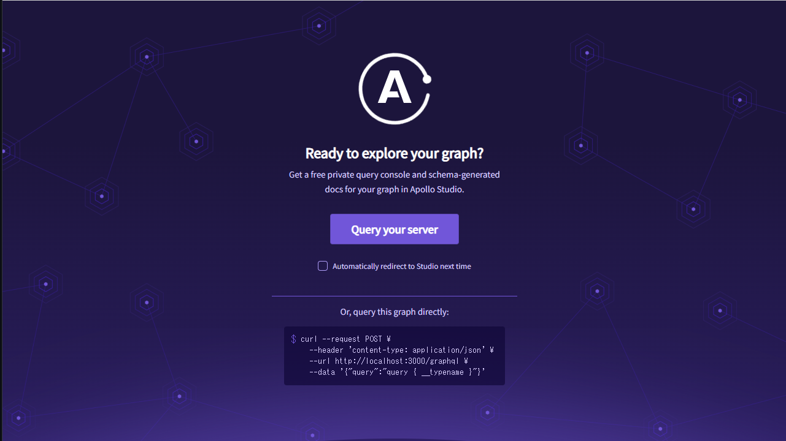
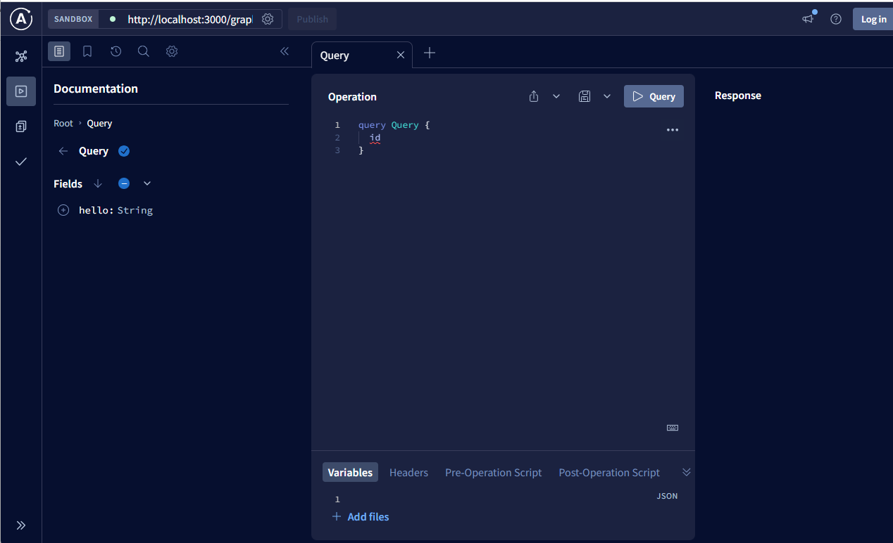

# graphql-handson

# 目次

0. ハンズオン全体の構成について
1. 環境構築：ライブラリのインストール等
2. Hello, GraphQL
3. クエリ事始
    - QueryとResolver
    - オブジェクトをグラフとしてとらえなおす
4. ミューテーション事始

# 0. ハンズオン全体の構成について

このハンズオンの目的はGraphQLの概要を抑えることです。概要には、Queryの基礎、Mutationの基礎を把握することが含まれます。基本的なライブラリのセットアップ等は完了しているので、各自のローカルマシン側の環境構築（1.の章）を実施すればすぐに開発を始められるようになっています。


# 1. 環境構築：ライブラリのインストール等

まず、WSL等のセットアップが済んでいない方は以下の手順に従ってセットアップをしてください。

https://gist.github.com/Showichiro/4f08e3a77980eac1729596eb79fa07d2

## リポジトリのclone

## NodeJSのインストール

続いて所定のバージョンのNodeJSをインストールします。

```sh
# .nvmrcでバージョン指定しているのでnvmを利用している場合はこのコマンドでOK
nvm use # nvm使っていない場合は、各自で21系を利用するように設定してください。
```

NodeJSはJavaScriptのサーバサイドランタイムです。

## pnpmのインストール

続いて、pnpmのインストール作業を行います。`corepack`によってバージョンを指定しているため、corepackを利用してインストール&パスを通します。


```sh
# nvm useしたターミナルで
corepack enable pnpm
pnpm -v # 9.3.0
pnpm i # corepack enable pnpmとやった時点でinstall走っているかも。
```

pnpmはライブラリ・依存関係のパッケージマネージャーです。

## 各種VSCodeの拡張機能のインストール

VSCodeでこのリポジトリを開いた状態で、左メニューからExtensions(□が4つあるアイコン)を選択する。


`Search Extensions`という検索窓に`@recommended`と入力し、`WORKSPACE RECOMMENDATIONS`に表示された拡張機能を全てインストールする。


## 開発サーバの起動

```sh
pnpm dev
```

`http://localhost:3000/graphql`にアクセスし、以下の画面がでればOK。



ターミナル上で`ctrl + c`を入力することで開発サーバを落とすことができます。


# 2.Hello, GraphQL

何はともあれ実際に、GraphQLのリクエストを投げてみましょう。

開発サーバを起動した状態で`http://localhost:3000/graphql`にアクセスします。

画面中央に`Query your server`というボタンがあるので押下します。

画面遷移し、以下のようにクエリのエディタが表示されます。



中央の`Operation`に以下のクエリを入力し、`▷Query`ボタンを押下してみてください。右側の`Response`の欄にGraphQLサーバからのレスポンスが表示されます。

```gql
{
  hello
}
```


このように、GraphQLサーバへのリクエストをブラウザ上から試すことができます。

では、このhelloというクエリはどのように実装されているのでしょうか。

`src/index.ts`を見ると、`typeDefs`、`resolvers`という二つのオブジェクトをimportしてServerを定義していることがわかります。

```ts
import { ApolloServer } from "apollo-server-express";
import { typeDefs, resolvers } from "./graphql";

const server = new ApolloServer({ typeDefs, resolvers });
```
では、`typeDefs`と`resolvers`というオブジェクトはどのように定義されているでしょうか。

`src/graphql.ts`を開いてください。以下のようになっています。


```ts
import { gql } from "apollo-server-express";

export const typeDefs = gql`
  type Query {
    hello: String
  }
`;

export const resolvers = {
  Query: {
    hello: () => "Hello, GraphQL with Apollo!",
  },
};
```

このtypeDefsという変数で宣言されている内容がGraphQLの`Schema`、resolversという変数で宣言されている内容がGraphQLの`Resolver`とです。
